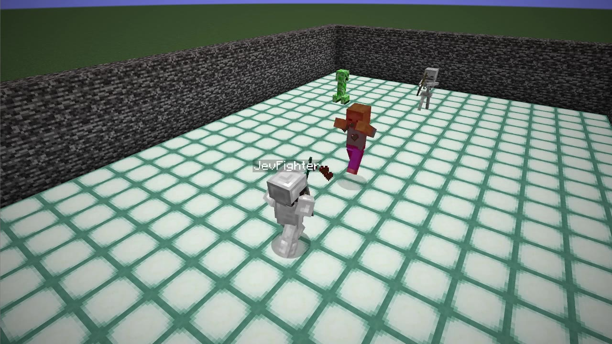

# Distilling Jev for Minecraft Combat

[**Explore the interactive demo →**](https://aibengineering.github.io/minecraft-jev-distillation/)

A local LightGBM policy trained to imitate [Jev](https://typesafe.ai)'s
decisions in Minecraft combat.

Jev can make decisions quickly, but calling a hosted model from Australia adds
network latency. This project uses Jev as a teacher, then runs the learned
policy locally to choose where to look, how to move, when to attack or guard,
whether to sprint, and whether to jump.



*The local LightGBM policy controlling the bot in the recorded demo.*

## The demo

Watch a short fight, pause at one decision, and compare Jev's JSON request and
response with the LightGBM features and predictions. Change the inputs to see
how the local model responds, then explore its validation scores, feature
importance, and selected partial dependence plots.

The recording uses LightGBM. Jev's response was queried afterward on the same
saved state.

## What's included

- **Interactive site** — the video, captured state, Jev request and response,
  decision probabilities, trained model, and precomputed analysis.
- **Combat bot** — a Mineflayer agent with Jev and LightGBM policies, plus
  [Mine Labs](https://github.com/aibengineering/mine-labs) arena scenarios.
- **Development tools** — training scripts, a fight replay viewer, and recording
  and evaluation utilities.

The model learns five decisions from 414 features, using 17,592 labeled windows
from 93 fights. The site reports grouped cross-validation agreement with Jev;
these scores measure imitation, not combat win rates.

Raw training samples, full fight logs, API keys, and the original OBS recording
are not included. Everything needed to build the demo is committed.

## Run the demo locally

Requires Bun 1.4 or newer. No Minecraft server, Python, or Jev API key is needed.

```sh
bun install --frozen-lockfile
bun site/build.ts --release
bunx serve dist
```

GitHub Actions builds the same assets and deploys them to GitHub Pages. Set the
repository's **Settings → Pages → Source** to **GitHub Actions**.

## Run the bot

With dependencies installed and Java 21 available, open the scenario dashboard
with the included model:

```sh
bun run labs:lgbm
```

Choose a fight in Mine Labs. Use **F10 → Return to Labs** to pick another;
decisions and probabilities are recorded automatically.

For live Jev, training, recording, and the code layout, see the
[development guide](docs/development.md). Details of the selected video and
analysis are in the [recording notes](site/recording.md).

Built with [Mineflayer](https://github.com/PrismarineJS/mineflayer) and
[Mine Labs](https://github.com/aibengineering/mine-labs). The presentation takes
inspiration from [R2D3](https://r2d3.us/visual-intro-to-machine-learning-part-1/).
